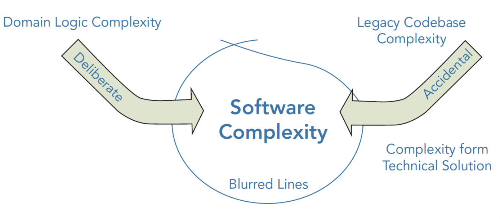

# 创建复杂问题领域软件的挑战

> 以下内容根据 [_Patterns, Principles And Practices Of Domain-driven Design_ (John Wiley & Sons, 2005)] 一书翻译并整理。

目前，大多数流行的业务应用软件架构设计模式都是大泥球 (Big Ball of Mud, BBoM)。BBoM 是 Brian Foote 和 Joseph Yoder 在他们的论文 [_Big Ball of Mud_] 中提出的，大意就是“一个结构杂乱、混乱不堪、意大利面条式的代码”。

Foote 和 Yoder 使用 BBoM 这个术语来描述一个看起来没有清晰架构的应用（对比一下一碗意大利面和一盘层次分明的意大利千层面）。使得软件逐步变为 BBoM 的问题也是显而易见的，也就是当工作流中的常规变更以及一些小的特性增强因阅读和理解现有代码具有困难而实现起来越来越具挑战性的时候。Eric Evans 在 [_Domain‐Driven
Design: Tackling Complexity in the Heart of Software_ (Addison‐Wesley Professional, 2003)] 中描述了这样的系统，它包含了“做了一些有用的事，但是却没有解释怎么去做的代码”。软件变得复杂且难以管理的一个重要原因就是将领域的复杂性与技术的复杂性混在了一起。

## 没有一个使用公共语言创建的代码

缺乏对一个公共语言以及问题领域知识的关注将会导致可以运行的代码不能够揭示业务的意图。这会导致代码变得难以阅读和维护，是因为在分析模型 (analysis model) 和代码模型 (code model) 之间做翻译是代价高昂的，且极易容易出错。

如果代码没有与一个分析模型进行绑定，那么随着时间的迁移，对业务的理解将会降低，因此也就会很容易导致 BBoM 式的架构。如果因为代价的问题，翻译团队没能在代码中充分利用问题领域的丰富词汇将会降低他们与业务专家协作时发现新问题领域概念的机会。

> **什么是分析模型**
>
> 分析模型是用于描述软件应用的逻辑设计和结构的。它可以使用草图或建模语言 UML 表示。它就是软件的描述，非技术人员可以根据它将软件概念化以便理解软件是如何构建的。

## 缺乏良好的组织

## 大泥球式的模式阻碍了开发

## 缺少对问题领域的关注