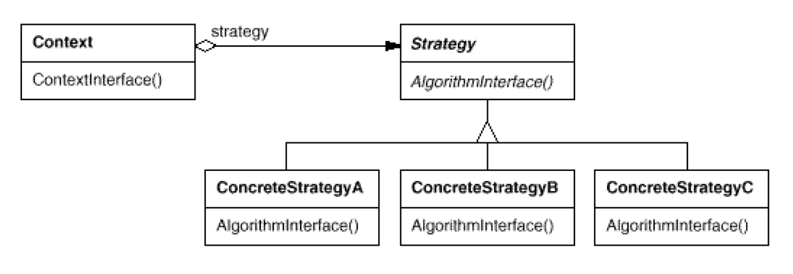

# STRATEGY（策略）

## 介绍

### 意图

定义一系列的算法，把它们一个个封装起来，并且使它们可以相互替换。本模式使得算法可独立于使用它的客户而变化。

### 别名

Policy（政策）

### 适用性

当存在以下情况时使用 Strategy 模式：

- 许多相关的类仅仅是行为有异。“策略”提供了一种有多个行为中的一个行为来配置一个类的方法。
- 需要使用一个算法的不同变体。例如，你可能会定义一些反映不同的空间/时间权衡的算法。当这些变体实现为一个算法的类层次时，可以使用策略模式。
- 算法使用客户不应该知道的数据。可使用策略模式以避免暴露复杂的、与算法相关的数据结构。
- 一个类定义了多种行为，并且这些行为在这个类的操作中以多个条件语句的形式出现。将相关的条件分支移入它们各自的 Strategy 类中以替代这些条件语句。

### 结构

### 参与者

- **Strategy**（策略）
  - 定义所有支持的算法的公共接口。Context 使用这个接口来调用某 ConcreteStrategy 定义的算法。
- **ConcreteStrategy**（具体策略）
  - 以 Strategy 接口实现某具体算法。
- **Context**（上下文）
  - 用一个 ConcreteStrategy 对象来配置。
  - 维护一个对 Strategy 对象的引用。
  - 可定义一个接口来让 Strategy 访问它的数据。

### 协作

- Strategy 和 Context 相互作用以实现选定的算法。当算法被调用时，Context 可以将算法所需要的所有数据都传递给该 Strategy。或者，Context 可以将自身作为一个参数传递给 Strategy 操作。这就让 Strategy 在需要时可以回调 Context。
- Context 将它的客户的请求转发给它的 Strategy。客户通常创建并传递一个 ConcreteStrategy 对象给该 Context；这样，客户仅与 Context 交互。通常有一系列的 ConcreteStrategy 类可供客户从中选择。