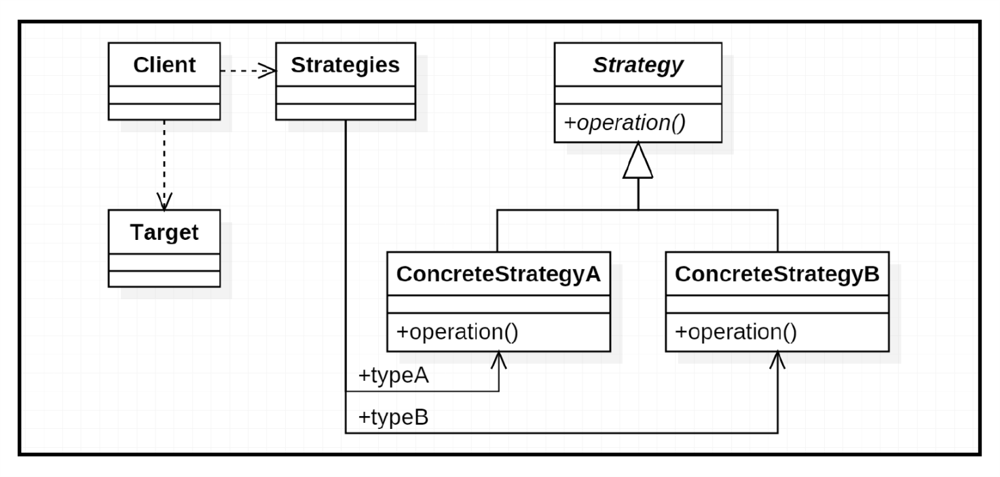

# STRATEGY（策略）

## 介绍

### 意图

定义一系列的算法，把它们一个个封装起来，并且使它们可以相互替换。本模式使得算法可独立于使用它的客户而变化。

### 别名

Policy（政策）

### 适用性

当存在以下情况时使用 Strategy 模式：

- 许多相关的类仅仅是行为有异。“策略”提供了一种有多个行为中的一个行为来配置一个类的方法。
- 需要使用一个算法的不同变体。例如，你可能会定义一些反映不同的空间/时间权衡的算法。当这些变体实现为一个算法的类层次时，可以使用策略模式。
- 算法使用客户不应该知道的数据。可使用策略模式以避免暴露复杂的、与算法相关的数据结构。
- 一个类定义了多种行为，并且这些行为在这个类的操作中以多个条件语句的形式出现。将相关的条件分支移入它们各自的 Strategy 类中以替代这些条件语句。

### 结构


_图 1_

### 参与者

- **Strategy**（策略）
  - 定义所有支持的算法的公共接口。Context 使用这个接口来调用某 ConcreteStrategy 定义的算法。
- **ConcreteStrategy**（具体策略）
  - 以 Strategy 接口实现某具体算法。
- **Context**（上下文）
  - 用一个 ConcreteStrategy 对象来配置。
  - 维护一个对 Strategy 对象的引用。
  - 可定义一个接口来让 Strategy 访问它的数据。

### 协作

- Strategy 和 Context 相互作用以实现选定的算法。当算法被调用时，Context 可以将算法所需要的所有数据都传递给该 Strategy。或者，Context 可以将自身作为一个参数传递给 Strategy 操作。这就让 Strategy 在需要时可以回调 Context。
- Context 将它的客户的请求转发给它的 Strategy。客户通常创建并传递一个 ConcreteStrategy 对象给该 Context；这样，客户仅与 Context 交互。通常有一系列的 ConcreteStrategy 类可供客户从中选择。

### 效果

Strategy 模式有下面的一些优点和缺点：

1. **相关算法系列**：Strategy 类层次为 Context 定义了一系列的可供重用的算法或行为。继承有助于析取出这些算法中的公共功能。
2. **一个替代继承的方法**：继承提供了另一种支持多种算法或行为的方法。你可以直接生成一个 Context 类的子类，从而给它以不同的行为。但这会将行为硬行编制到 Context 中，而将算法的实现与 Context 的实现混合起来，从而使 Context 难以理解、难以维护和难以扩展，而且还不能动态地改变算法。最后你得到一堆相关地类，它们之间的唯一差别是它们所使用的算法或行为。将算法封装在独立的 Strategy 类中使得你可以独立于其 Context 改变它，使它易于切换、易于理解、易于扩展。
3. **清除一些条件语句**：Strategy 模式提供了用条件语句选择所需的行为以外的另一种选择。当不同的行为堆砌在一个类中时，很难避免使用条件语句来选择合适的行为。将行为封装在一个个独立的 Strategy 类中消除了这些条件语句。
4. **实现的选择**：Strategy 模式可以提供相同行为的不同实现。客户可以根据不同时间/空间权衡取舍要求从不同策略中进行选择。
5. **客户必须了解不同的 Strategy**：本模式有一个潜在的缺点，就是一个客户要选择一个合适的 Strategy 就必须知道这些 Strategy 到底有何不同。有时可能不得不向客户暴露具体的实现问题。因此仅当这些不同行为变体与客户的行为相关时，才需要使用 Strategy 模式。
6. **Strategy 与 Context 之间的通信开销**：无论各个 ConcreteStrategy 实现的算法是简单还是复杂，它们都共享 Strategy 定义的接口。因此很可能某些 ConcreteStrategy 不会都用到所有通过这个接口传递给它们的信息；简单的 ConcreteStrategy 可能不使用其中的任何消息！这就意味着有时 Context 会创建和初始化一些永远不会用到的参数。如果存在这样问题，那么将需要在 Strategy 和 Context 之间更进行紧密的耦合。
7. **增加了对象的数目**：Strategy 增加了一个应用中的对象的数目。有时你可以将 Strategy 实现为可供各 Context 共享的无状态的对象来减少这一开销。任何其余的状态都由 Context 维护。Context 在每一次对 Strategy 对象的请求中都将这个状态传递过去。共享的 Strategy 不应在各次调用之间维护状态。Flywight 模式更详细地描述了这一方法。

## 示例 01

**提示**：以下内容节选自 [C# 3.0 Design Patterns, O'Reilly, 2007]，部分内容有所修改。

下面的这个示例很贴合 [图 1] 的结构：

### 实现

```csharp
using System;

namespace Strategy
{
    // Context
    class Context
    {
        // Context 状态
        public const int start = 5;
        public int Counter = 5;

        // Strategy 聚合
        IStrategy strategy = new Strategy1();

        // Algorithm 调用 Strategy 提供的方法
        public int Algorithm()
        {
            return strategy.Move(this);
        }

        // 更改 Strategy
        public void SwitchStrategy()
        {
            if (strategy is Strategy1)
            {
                strategy = new Strategy2();
            }
            else
            {
                strategy = new Strategy1();
            }
        }
    }

    // Strategy 接口
    interface IStrategy
    {
        int Move(Context ctx);
    }
  
    // Strategy 1
    class Strategy1 : IStrategy
    {
        public int Move(Context ctx)
        {
            return ++ctx.Counter;
        }
    }
  
    // Strategy 2
    class Strategy2 : IStrategy
    {
        public int Move(Context ctx)
        {
            return --ctx.Counter;
        }
    }
  
    class Program
    {
        static void Main(string[] args)
        {
            var ctx = new Context();
            ctx.SwitchStrategy();

            var r = new Random(37);
            for (var i = Context.start; i <= Context.start + 15; i++)
            {
                if (r.Next(3) == 2)
                {
                    Console.Write("|| ");
                    ctx.SwitchStrategy();
                }
                Console.Write(ctx.Algorithm() + " ");
            }
            Console.WriteLine();
        }
    }
}
```

```bash
4 || 5 6 7 || 6 || 7 8 9 10 || 9 8 7 6 || 7 || 6 5
```

在 C# 中，策略模式的实现有以下几个关键点：

- Context 中常常会包含一个用于选择具体策略的 `switch` 或级联的 `if` 声明。
- 如果 Strategy 是很简单的方法，我们可以借助委托而非将其放在某个类中来实现。
- 扩展方法可以用于为原始的类独立地定义新的策略。

## 示例 02

**提示**：以下内容节选自 [TypeScript Design Patterns, Packt, 2016]，部分内容有所修改。

在此书中，作者提到在 JavaScript 中可以通过多种方式来组合这些策略对象或类，除了 [图 1] 外，还可以使用以下一种结构：


_图 2_

在这个结构中，Client 负责从策略表中提取特定的策略并将策略的操作应用到当前阶段。这个结构中除了没有 Context 外，存在额外三个参与者：

- **Strategy Manager (Strategies)**（策略管理器）
  - 它定义了一种数据结构用于管理这些策略对象。比如，可以使用一个简单的哈希表，数据类型名称作为 key，对应的策略对象作为 value。
- **Target**（目标）
  - 目标用于应用策略对象中定义的算法。
- **Client**（客户端）
  - 保证目标和策略管理器能够相互协作。

### 实现

我们有两个 `ITarget` 类型，通过字符串字面量类型 `'a'` 和 `'b'` 区分。类型为 `'a'` 的 `ITarget` 有一个类型是字符串的 `result` 属性，而类型为 `'b'` 的 `ITarget` 有一个类型是数字的 `value` 属性，接口如下：

```typescript
type TargetType = 'a' | 'b';

interface ITarget {
  type: TargetType;
}

interface ITargetA extends ITarget {
  type: 'a';
  result: string;
}

interface ITargetB extends ITarget {
  type: 'b';
  value: number;
}

interface IStrategy<TTarget extends ITarget> {
  operationX(target: TTarget): void;
  operationY(target: TTarget): void;
}
```

现在我们继续定义两个 `IStrategy` 类型实现：

```typescript
let strategyA: IStrategy<ITargetA> = {
  operationX(target: ITargetA): void {
    target.result = target.result + target.result;
    console.log(`strategyA.operationX: ${target.result}`);
  },

  operationY(target: ITargetA): void {
    target.result = target
      .result
      .substr(Math.floor(target.result.length / 2));
    console.log(`strategyA.operationY: ${target.result}`);
  }
};

let strategyB: IStrategy<ITargetB> = {
  operationX(target: ITargetB): void {
    target.value = target.value * 2;
    console.log(`strategyB.operationX: ${target.value}`);
  },

  operationY(target: ITargetB): void {
    target.value = Math.floor(target.value / 2);
    console.log(`strategyB.operationY: ${target.value}`);
  }
};
```

最后执行测试一下：

```typescript
let strategies: {
  [type: string]: IStrategy<ITarget>
} = {
  a: strategyA,
  b: strategyB
};

(() => {
  const targets: ITarget[] = [
    <ITargetA>{ type: 'a', result: 'hello' },
    <ITargetA>{ type: 'a', result: 'world' },
    <ITargetB>{ type: 'b', value: 10 }
  ];

  for (const target of targets) {
    const strategy: IStrategy<ITarget> = strategies[target.type];
    strategy.operationX(target);
    strategy.operationY(target);
  }
})();
```

```bash
strategyA.operationX: hellohello
strategyA.operationY: hello
strategyA.operationX: worldworld
strategyA.operationY: world
strategyB.operationX: 20
strategyB.operationY: 10
```